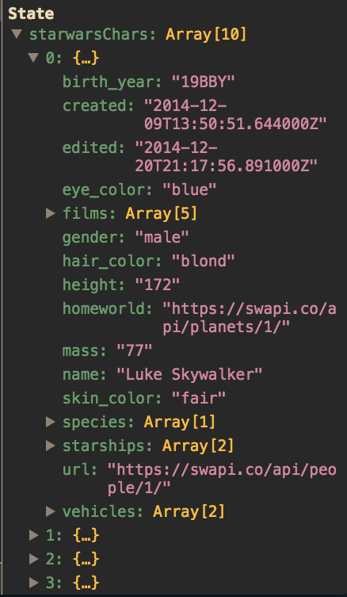

# Sprint Challenge: React - Star Wars

This challenge allows you to practice the concepts and techniques learned over the past Sprint and apply them in a concrete project. This Sprint explored ReactJS, Functional Components and Class Components. In your challenge for this Sprint, you will demonstrate proficiency by creating an application that uses ReactJS to consume live data retrieved from the World Wide Web and style that data nicely on the page.

## Instructions

**Read these instructions carefully. Understand exactly what is expected _before_ starting this Sprint Challenge.**

This is an individual assessment. All work must be your own. Your challenge score is a measure of your ability to work independently using the material covered through this sprint. You need to demonstrate proficiency in the concepts and objectives introduced and practiced in preceding days.

You are not allowed to collaborate during the Sprint Challenge. However, you are encouraged to follow the twenty-minute rule and seek support from your PM and Instructor in your cohort help channel on Slack. Your work reflects your proficiency ReactJS Fundamentals and your command of the concepts and techniques in the Function Components and Class Components.

You have three hours to complete this challenge. Plan your time accordingly.

## Commits

Commit your code regularly and meaningfully. This helps both you (in case you ever need to return to old code for any number of reasons and your project manager.

## Description

In this challenge, create a web page that presents a styled list of Star Wars characters. Being able to render out data to a web page is a large part of what JavaScript developers do, this challenge assesses your ability to achieve such a task.

## Self-Study/Essay Questions

Demonstrate your understanding of this Sprint's concepts by answering the following free-form questions. Edit this document to include your answers after each question. Make sure to leave a blank line above and below your answer so it is clear and easy to read by your project manager.

- [x] What is React JS and what problems does it try and solve? Support your answer with concepts introduced in class and from your personal research on the web.

React JS is a user-interface library that is used by many developers to build web applications - particularly web applications that have lots of changes to data - this can be from user interaction or input or 3p updates to the database where the application pulls from.

Developed and supported by the facebook web team, React JS has become popular because of its component-focused approach to building web application - in short, this means that the base unit of a React application is a component. The beauty of the component-focused approach is that each component "owns" its own part of the DOM. 

Components re-render when the state of the component changes via React's virtual DOM and a process called reconciliation which is a diffing process where React compares two React DOM elements, keeps the nodes that have not been changed and only updates the changed attributes. This diffing process makes things extremely efficient and takes a lot of work off the actual DOM because the shallow merging is done by React's engine before the DOM is re-rendered.

Components are also extremely useful because of their reusability. Modern web application teams frequently work with designers to establish component libraries. Creating components reduces the cost of onboarding new engineers and the cost of frequent decision-making related to behavior of components, etc. For all developers, this is means that they have a set of go-to UI paradigms they can plug-and-play as the application expands and that there is one source of truth to consider if there are missing components or components that need to be updated.

- [x] What does it mean to _think_ in react?

Thinking in React means that a developer needs to consider why React JS was developed - to develop and scale data-rich and UI-intensive web applications. The benefits of React, as described above, include reusability, efficiency, and general scalability through the use of components. 

Keeping in mind that we are always going to be component-focused in React, a developer will consider things very seriously the single-responsibility principle which states that web components should be really good at doing its one job. Another key consideration of thinking in React will then be thinking through which components need to hold its own state and which components will be stateless - simply put, how is data going to be flowing through the application and which components will be consistently be reacting to user interaction. 

It should follow that a React project should have many components that do their respective jobs really will and can be compiled (like Lego blocks) into a larger structure. 

- [x] Describe state.
State was described in our Training Kit as the heart of an application. I think that is a great, but potentially confusing analogy. State is indeed a central repository of data that we want a component to hold onto and "pump" to other stateless components. An extremely important characteristic of state is that when it changes, our React app will re-render. In this way, our components that have access to the state in some manner (will be described below in discussion of props) will be able to "react" to changes to the state of the application.

- [x] Describe props.
Using the analogy of the circulatory system, props would then be like the arteries that carry blood (the data) from state to another component. Props is an object that will allow state-carrying components to pass data to other components. Something really important remember is that data flows top-down typically in this bottom and then responses will go bottom-up back to the state when a component triggers some change in state. 

## Project Set Up

Follow these steps to set up and work on your project:

- [x] Create a forked copy of this project.
- [x] Add PM as collaborator on Github.
- [x] Clone your OWN version of Repo (Not Lambda's by mistake!).
- [x] Create a new Branch on the clone: git checkout -b `<firstName-lastName>`.
- [x] Change directories into `./starwars` (`cd starwars`) and run `yarn install` to retrieve all needed dependencies.
- [x] Once you have installed the _node_modules_, run `yarn start or` to get your server up and running.
- [x] With the server up and running, open Chrome and head over to `localhost:3000` and view your beautiful app. Maybe it's not _that_ pretty... _yet_, your goal is to ensure this project becomes a thing of beauty.
Follow these steps for completing your project.
- [x] Implement the project on this Branch, committing changes regularly.
- [x] Push commits: git push origin `<firstName-lastName>`.

Follow these steps for completing your project:

- [x] Submit a Pull-Request to merge <firstName-lastName> Branch into master (student's  Repo).
- [x] Add your Project Manager as a Reviewer on the Pull-request
- [x] PM then will count the HW as done by  merging the branch back into master.

Please note:

- `componentDidMount()` calls an open sourced API inside of `App.js` and saves the results of that API on state.
- Upon opening the `App.js` file you'll see that there is code written out that looks like this:

```js
componentDidMount() {
  this.getCharacters('https://swapi.co/api/people');
}

getCharacters = URL => {
  fetch(URL)
    .then(res => {
      return res.json();
    })
    .then(data => {
      this.setState({ starwarsChars: data.results });
    })
    .catch(err => {
      throw new Error(err);
    });
};
```

- [x] You don't need to understand what that code is doing fully, other than the fact that it is setting your state with Star Wars Character Data.
- [x] View your `App` component's `state` by opening the Chrome `React Dev Tools` to peek at the data set. At this point you will know what to do from here.

Your data set will look like this:



- [x] Based on knowledge gained over the past Sprint

## Minimum Viable Product

Your finished project must include all of the following requirements:

- [x] A list of Star Wars Characters rendered to the screen.
- [x] You must have at least one list element for each star wars character in the data set.
- [x] The list elements must all be styled beyond the basic

In your solution, it is essential that you follow best practices and produce clean and professional results. Schedule time to review, refine, and assess your work and perform basic professional polishing including spell-checking and grammar-checking on your work. It is better to submit a challenge that meets MVP than one that attempts to much and does not.

## Stretch Problems

- [ ] Build a pagination system that will allow you to load the next page of data

- [x] Take note on the data that's coming back from the server call in our `getCharacters`
- [x] console.log() the data coming back from the server.
- [x] Notice that there are `next` `previous` fields that give you a URL.
- You have a function that will get chars called `getCharacters` you'll want to just call this function and supply it with the proper fields. You'll need to set this up on state to do this.

```js
 .then(data => {
    console.log(data); <-- Log data here to find the fields you will need.
    this.setState({ starwarsChars: data.results });
  })
```

- [ ] Build another app from scratch that looks very similar to this one. Inside of your main `App` component fetch some data in this same fashion from this url `https://dog.ceo/dog-api/#all` you'll have to follow the documentation at that website and figure out how to change up the code you've seen here in this Star Wars app in order to properly fetch the data and store it on Component State.

- Be mindful of the `fetch API` that is now built into most modern browsers [Fetch API](https://developer.mozilla.org/en-US/docs/Web/API/Fetch_API/Using_Fetch).
- Your data coming back from Dogs should be formatted in JSON format.
